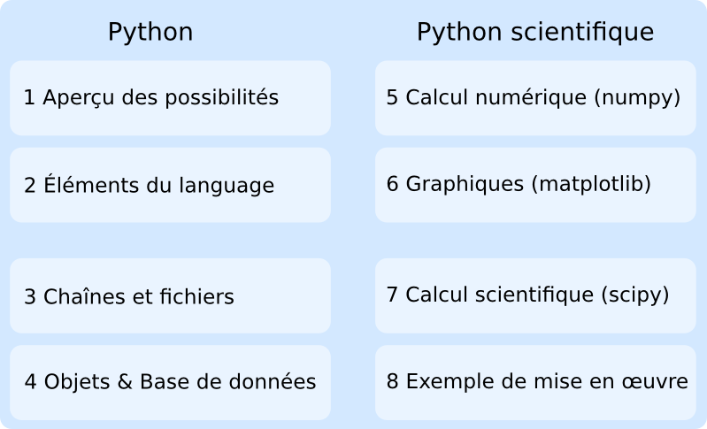

Introduction
------------

Ce document est destiné à élaborer collaborativement une formation
à Python et Python scientifique (Numpy, Scipy, matplotlib, ...)
à destination des enseignants des classes préparatoires aux grandes écoles.

La formation, prévue sur *deux jours* comporte 2x4 séances de 1h30 (12h au total),
avec

* un premier jour centré sur Python "en général" 
* et le 2ème sur Python scientifique

Organisation éventuellement à revoir avec une possibilité de démarrer la
présentation des aspects scientiques plus tôt

Pour rendre un peu plus concrets les concepts présentés, chaque séance s'appuira sur
un ou des exemples.

